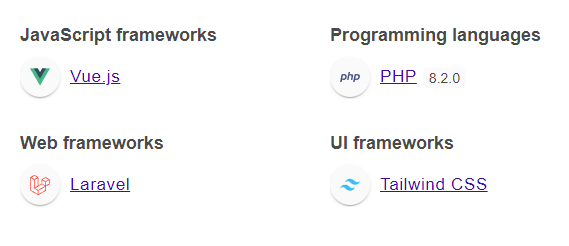
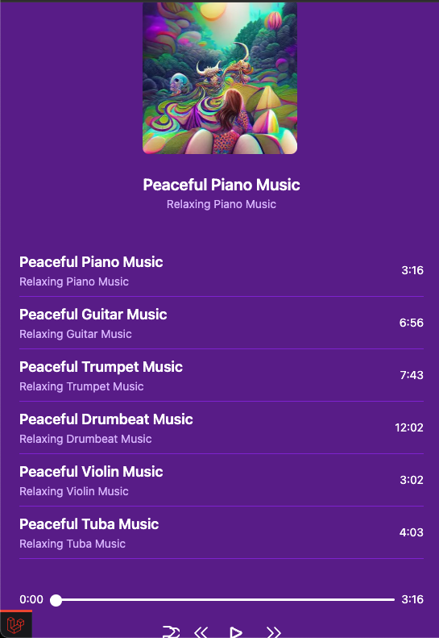
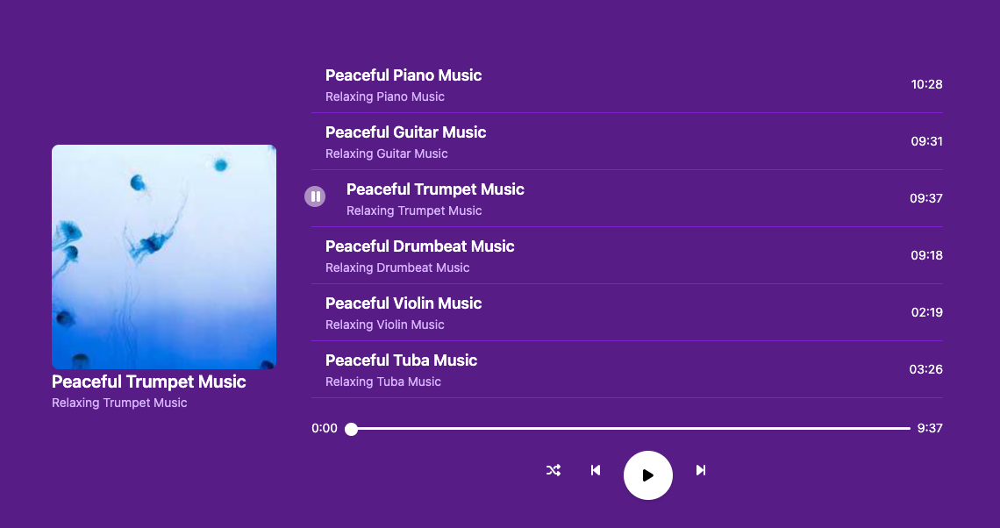
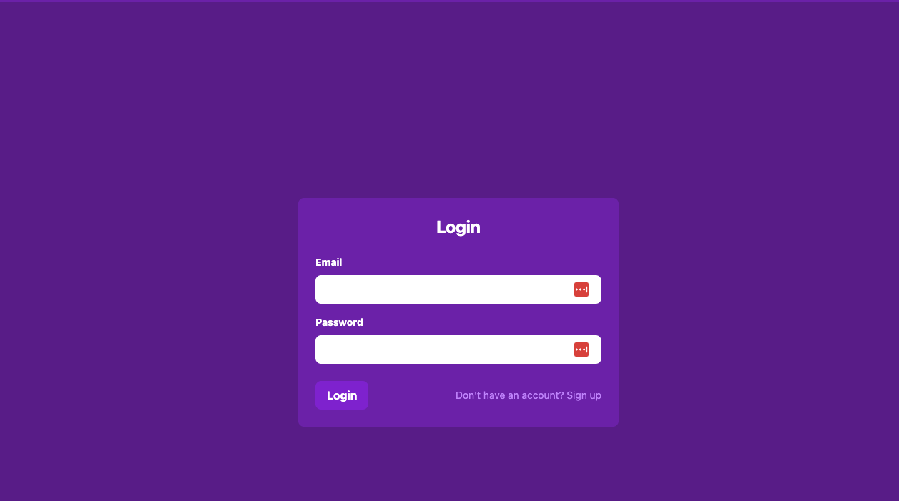
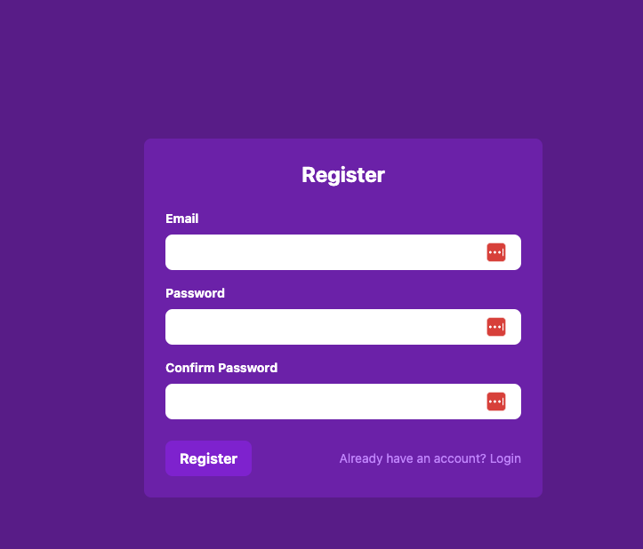

### Setup Locally

```
cp .env.example .env
```

```
composer install
```

```
php artisan migrate
php artisan db:seed --class=SongsTableSeeder
```

```
php artisan key:generate
```

```
php artisan serve
```

### Client :

```
npm install
```

```
npm run dev
```

## App screenshots
### Mobile view


### Desktop view


### Login screen


### Register screen


